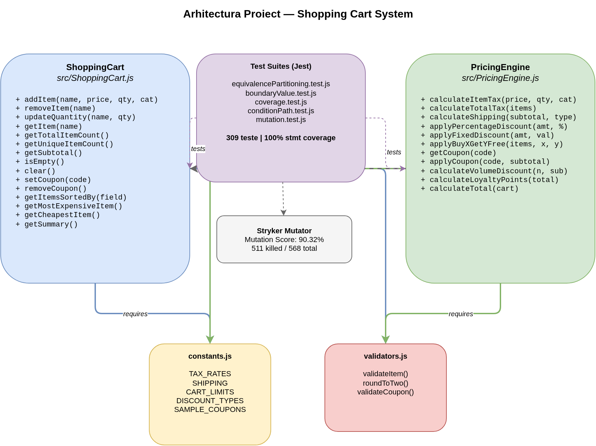
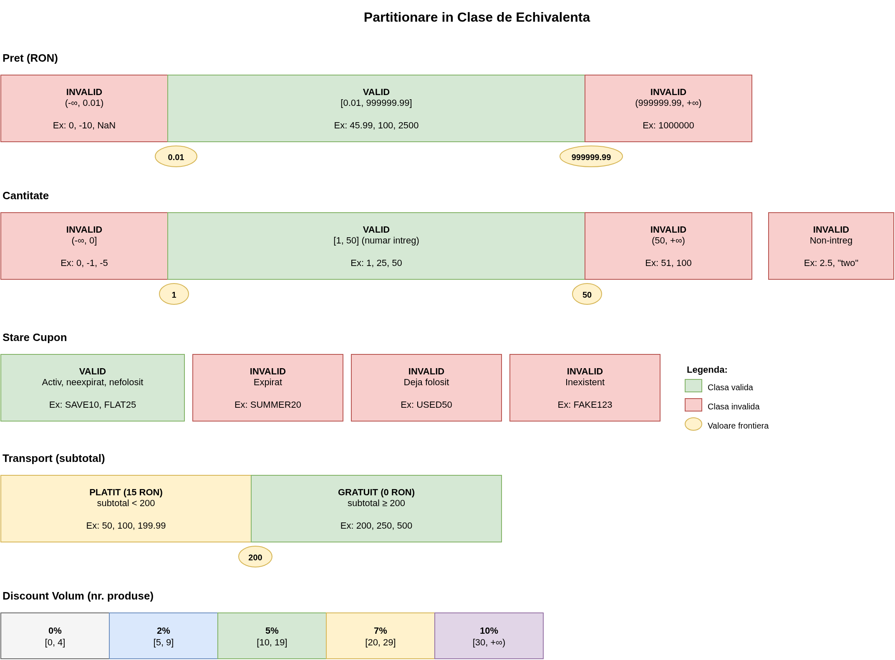
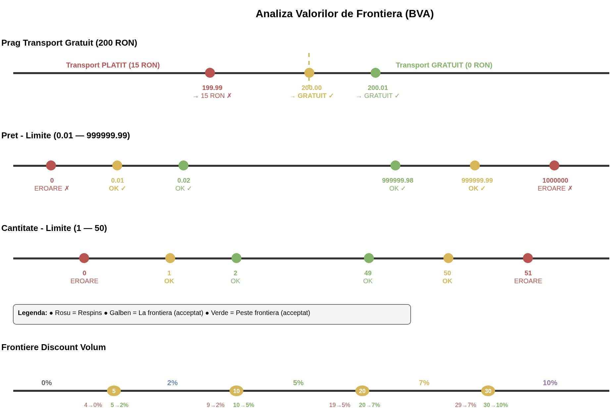
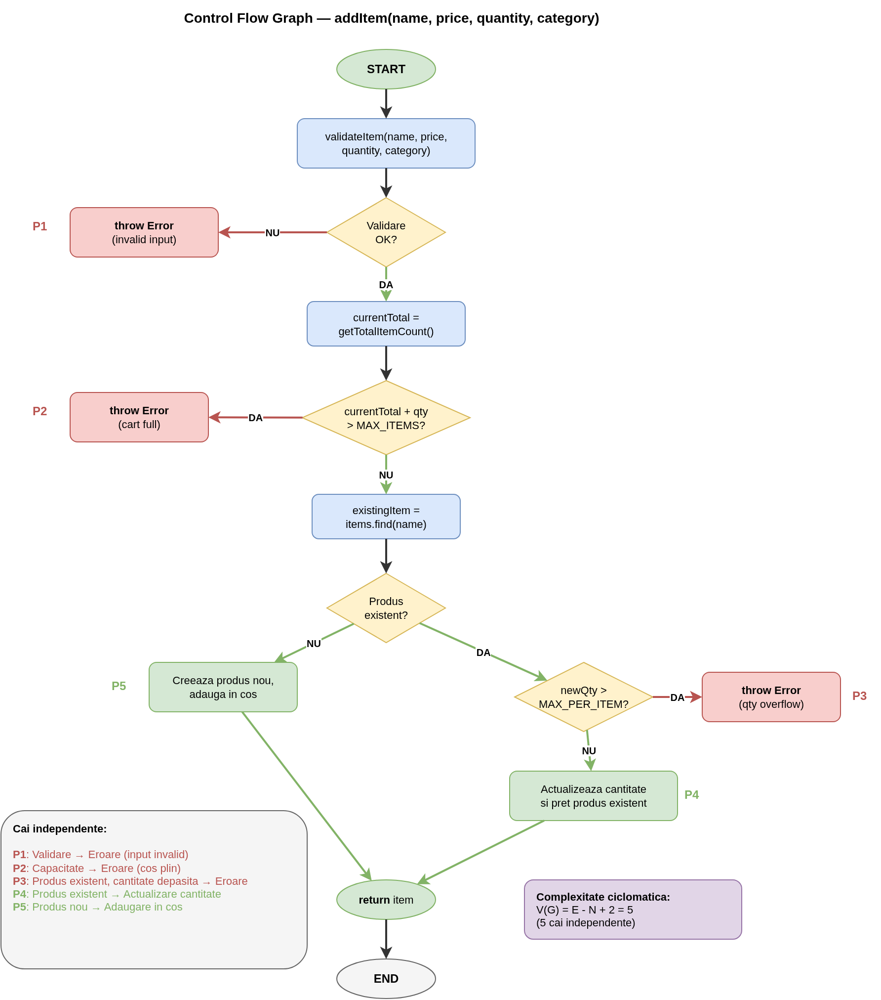
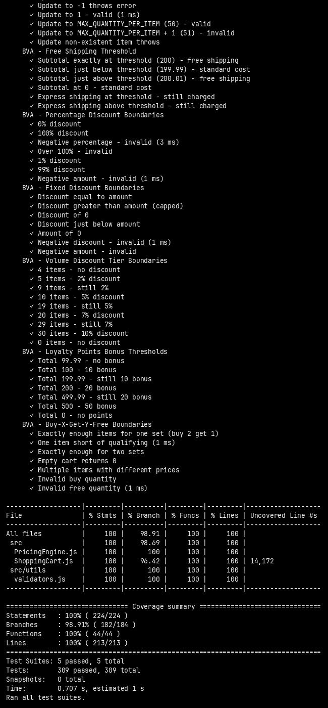
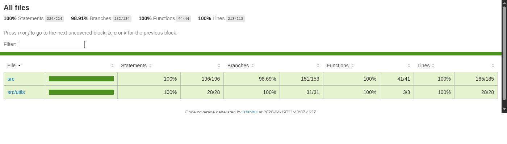
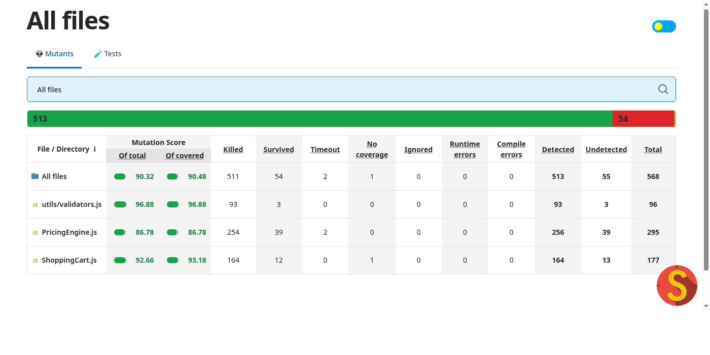
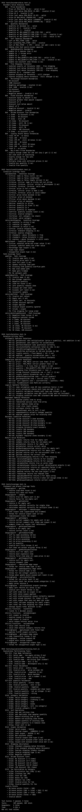
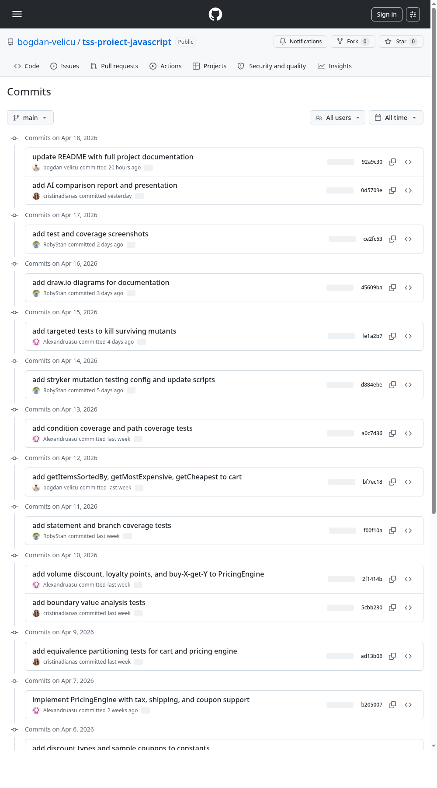

# Testarea Sistemelor Software — Proiect Echipa

## Tema: T4 — Testare unitara in JavaScript

Proiect realizat in cadrul cursului **Testarea Sistemelor Software**, Facultatea de Matematica si Informatica, anul IV, semestrul II.

## Echipa

| Nume | GitHub | Contributii |
|------|--------|-------------|
| Bogdan Velicu | [@bogdan-velicu](https://github.com/bogdan-velicu) | Setup proiect, ShoppingCart, configurare Jest |
| Alexandru Satalla | [@Alexandruasu](https://github.com/Alexandruasu) | PricingEngine, validari, constante |
| Cristina Diana Savin | [@cristinadianas](https://github.com/cristinadianas) | Teste EP si BVA |
| Robert Stan | [@RobyStan](https://github.com/RobyStan) | Teste coverage, Stryker, mutation testing |

## Descriere proiect

Proiectul consta in implementarea si testarea unitara a unui **sistem de shopping cart cu motor de preturi** (ShoppingCart + PricingEngine) in JavaScript, folosind framework-ul **Jest** pentru testare si **Stryker Mutator** pentru mutation testing.

### Clasele testate

**ShoppingCart** (`src/ShoppingCart.js`)
- Adaugare, stergere, actualizare produse in cos
- Validare cantitati, preturi, categorii
- Calculare subtotal, numarare produse
- Gestionare cupoane de reducere
- Sortare produse, identificare cel mai scump/ieftin produs

Metoda centrala `addItem` — valideaza inputul, verifica capacitatea cosului si trateaza produsele duplicate prin actualizarea cantitatii:

```javascript
addItem(name, price, quantity = 1, category = null) {
  validateItem(name, price, quantity, category);

  const currentTotal = this.getTotalItemCount();
  if (currentTotal + quantity > CART_LIMITS.MAX_ITEMS) {
    throw new Error(`Cannot add ${quantity} items. Cart limit is ${CART_LIMITS.MAX_ITEMS} (currently ${currentTotal})`);
  }

  const existingItem = this.items.find(item => item.name === name);
  if (existingItem) {
    const newQuantity = existingItem.quantity + quantity;
    if (newQuantity > CART_LIMITS.MAX_QUANTITY_PER_ITEM) {
      throw new Error(`Total quantity for "${name}" would exceed the limit of ${CART_LIMITS.MAX_QUANTITY_PER_ITEM}`);
    }
    existingItem.quantity = newQuantity;
    existingItem.price = price;
    return existingItem;
  }

  const newItem = { name: name.trim(), price: roundToTwo(price), quantity, category };
  this.items.push(newItem);
  return newItem;
}
```

**PricingEngine** (`src/PricingEngine.js`)
- Calculare taxe pe categorii de produse (electronics 19%, clothing 9%, food/books 5%)
- Calculare cost transport (gratuit peste 200 RON)
- Aplicare reduceri procentuale si fixe
- Validare si aplicare cupoane de reducere
- Reduceri pe volum (5+ produse: 2%, 10+: 5%, 20+: 7%, 30+: 10%)
- Calculare puncte de fidelitate
- Promotie buy-X-get-Y-free
- Calcul total final (subtotal - reduceri + taxe + transport)

Metoda `calculateShipping` — conditie compusa ce determina costul de transport in functie de tipul livrarii si de pragul pentru transport gratuit:

```javascript
calculateShipping(subtotal, shippingType = 'standard') {
  if (typeof subtotal !== 'number' || subtotal < 0) {
    throw new Error('Subtotal must be a non-negative number');
  }

  const validTypes = ['standard', 'express'];
  if (!validTypes.includes(shippingType)) {
    throw new Error(`Invalid shipping type. Use: ${validTypes.join(', ')}`);
  }

  // transport gratuit pentru comenzi standard peste prag
  if (shippingType === 'standard' && subtotal >= SHIPPING.FREE_THRESHOLD) {
    return 0;
  }

  return shippingType === 'express' ? SHIPPING.EXPRESS_COST : SHIPPING.STANDARD_COST;
}
```

Metoda `calculateTotal` — orchestreaza intregul pipeline de calcul: reduceri pe volum, cupoane, taxe, transport si puncte de fidelitate:

```javascript
calculateTotal(cart) {
  if (!cart || typeof cart.getSubtotal !== 'function') {
    throw new Error('Invalid cart object');
  }

  if (cart.isEmpty()) {
    return { subtotal: 0, discount: 0, couponDiscount: 0, volumeDiscount: 0,
             tax: 0, shipping: 0, total: 0, loyaltyPoints: 0, savings: 0 };
  }

  const subtotal = cart.getSubtotal();
  const totalItems = cart.getTotalItemCount();

  const volumeDiscount = this.calculateVolumeDiscount(totalItems, subtotal);

  let couponDiscount = 0;
  if (cart.appliedCoupon) {
    try {
      couponDiscount = this.applyCoupon(cart.appliedCoupon, subtotal - volumeDiscount);
    } catch (e) {
      couponDiscount = 0;
    }
  }

  const totalDiscount = roundToTwo(volumeDiscount + couponDiscount);
  const discountedSubtotal = roundToTwo(subtotal - totalDiscount);

  const tax = this.calculateTotalTax(cart.items);
  const taxOnDiscounted = roundToTwo(tax * (discountedSubtotal / subtotal));
  const shipping = this.calculateShipping(discountedSubtotal);

  const total = roundToTwo(discountedSubtotal + taxOnDiscounted + shipping);
  const loyaltyPoints = this.calculateLoyaltyPoints(total);

  return { subtotal, discount: totalDiscount, couponDiscount, volumeDiscount,
           tax: taxOnDiscounted, shipping, total, loyaltyPoints, savings: totalDiscount };
}
```

## Diagrame

### Arhitectura sistemului

Diagrama de mai jos prezinta componentele principale ale sistemului si relatiile dintre ele: `ShoppingCart` gestioneaza produsele si cupoanele, `PricingEngine` calculeaza taxe, reduceri si totalul final, iar modulele utilitare (`validators.js`, `constants.js`) furnizeaza validari si constante partajate.



### Clase de echivalenta

Diagrama ilustreaza partitionarea domeniilor de intrare in clase valide si invalide pentru fiecare parametru al functiilor testate (nume produs, pret, cantitate, categorie, cupoane, transport, reduceri pe volum).



### Valori de frontiera

Diagrama prezinta valorile critice de la frontierele fiecarui domeniu — punctele exacte unde comportamentul sistemului se schimba (ex: pret minim 0.01, prag transport gratuit 200, praguri reducere volum la 5/10/20/30 produse).



### Graful de flux de control (CFG) — `addItem`

Control Flow Graph-ul metodei `addItem` din `ShoppingCart`, utilizat pentru analiza acoperirii la nivel de cale si conditie. Graful evidentiaza ramurile de decizie: validare input, verificare capacitate cos, tratare produs existent vs. nou.



## Strategii de testare

### 1. Partitionare in clase de echivalenta (Equivalence Partitioning)

Am identificat urmatoarele clase de echivalenta:

| ID | Domeniu | Clasa valida | Clasa invalida |
|----|---------|-------------|----------------|
| EC1-EC2 | Nume produs | String non-vid | null, undefined, numar, string gol |
| EC3-EC4 | Pret | 0.01 - 999999.99 | 0, negativ, NaN, string, > max |
| EC5-EC6 | Cantitate | 1 - 50 (intreg) | 0, negativ, float, string, > 50 |
| EC7-EC8 | Categorie | electronics, clothing, food, books | Alte stringuri |
| EC9-EC12 | Cupon | Valid si activ | Expirat, folosit, inexistent |
| EC13-EC14 | Transport | >= 200 (gratuit) | < 200 (platit) |
| EC15 | Volum discount | 0-4, 5-9, 10-19, 20-29, 30+ | - |

Fisier: `tests/equivalencePartitioning.test.js`

### 2. Analiza valorilor de frontiera (Boundary Value Analysis)

Am testat valorile la frontierele fiecarui domeniu:

| Domeniu | Sub frontiera | La frontiera | Peste frontiera |
|---------|--------------|-------------|----------------|
| Pret (min) | 0 (respins) | 0.01 (acceptat) | 0.02 (acceptat) |
| Pret (max) | 999999.98 | 999999.99 | 1000000 (respins) |
| Cantitate (min) | 0 (respins) | 1 (acceptat) | 2 (acceptat) |
| Cantitate (max) | 49 | 50 | 51 (respins) |
| Transport gratuit | 199.99 (platit) | 200 (gratuit) | 200.01 (gratuit) |
| Discount 5 items | 4 (0%) | 5 (2%) | 6 (2%) |
| Discount 10 items | 9 (2%) | 10 (5%) | 11 (5%) |
| Bonus fidelitate 100 | 99.99 (fara bonus) | 100 (+10) | 100.01 (+10) |

Fisier: `tests/boundaryValue.test.js`

### 3. Acoperire la nivel de instructiune si decizie (Statement & Branch Coverage)

Rezultate Jest --coverage:

```
-------------------|---------|----------|---------|---------|
File               | % Stmts | % Branch | % Funcs | % Lines |
-------------------|---------|----------|---------|---------|
All files          |     100 |    98.91 |     100 |     100 |
 PricingEngine.js  |     100 |      100 |     100 |     100 |
 ShoppingCart.js   |     100 |    96.42 |     100 |     100 |
 validators.js     |     100 |      100 |     100 |     100 |
-------------------|---------|----------|---------|---------|
```

Captura de ecran cu raportul de acoperire generat de Jest:



Raportul HTML detaliat (lcov) permite inspectarea acoperirii la nivel de linie pentru fiecare fisier sursa:



Fisier: `tests/coverage.test.js`

### 4. Acoperire la nivel de conditie si cale (Condition & Path Coverage)

Am identificat conditiile compuse din cod si am testat toate combinatiile de sub-conditii.

Fisier: `tests/conditionPath.test.js`

### 5. Mutation Testing

Am folosit **Stryker Mutator** pentru a genera mutanti si a verifica calitatea testelor.

Rezultate: **90.32% mutation score** (511 killed / 568 total)

Captura de ecran cu raportul Stryker:



Fisier: `tests/mutation.test.js`

## Comparatie teste proprii vs. teste generate de AI

Am realizat o analiza comparativa intre suita noastra de teste (309 teste, 5 strategii) si teste generate automat de **ChatGPT (GPT-4)**. Raportul complet este disponibil in [`raport-ai.md`](raport-ai.md).

Principalele concluzii:

| Metrica | Teste proprii | Teste AI (ChatGPT) |
|---------|:------------:|:------------------:|
| Total teste | 309 | ~85 |
| Statement coverage | 100% | 94% |
| Branch coverage | 98.91% | 78% |
| Mutation score | 90.32% | ~72% |

Testele AI ofera un **punct de plecare rapid** cu acoperire decenta, dar nu inlocuiesc strategiile sistematice (EP, BVA, acoperire conditie, mutation testing) necesare pentru o suita de calitate ridicata. Detalii, exemple de cod comparative si analiza calitativa se gasesc in raportul dedicat.

## Rezultate rulare teste

Suita completa contine **309 teste** distribuite pe 5 fisiere, acoperind toate cele 5 strategii de testare. Mai jos, captura de ecran cu rularea intregii suite:



## Contributii echipa

Istoric commituri pe repository:



## Tehnologii utilizate

| Tool | Versiune | Scop |
|------|---------|------|
| Node.js | v25.8.1 | Runtime JavaScript |
| npm | 11.12.1 | Package manager |
| Jest | 29.7.0 | Framework testare unitara |
| Stryker Mutator | 8.6.0 | Mutation testing |

## Structura repository

```
.
├── src/
│   ├── ShoppingCart.js
│   ├── PricingEngine.js
│   └── utils/
│       ├── constants.js
│       └── validators.js
├── tests/
│   ├── equivalencePartitioning.test.js
│   ├── boundaryValue.test.js
│   ├── coverage.test.js
│   ├── conditionPath.test.js
│   └── mutation.test.js
├── diagrams/                 # Diagrame draw.io
├── screenshots/              # Capturi de ecran
├── package.json
├── jest.config.js
├── stryker.config.js
├── raport-ai.md              # Raport comparatie teste proprii vs AI
├── TSS_Prezentare_T4.pptx    # Prezentare
└── README.md
```

## Instalare si rulare

```bash
# Instalare dependinte
npm install

# Rulare teste
npm test

# Rulare teste cu raport de acoperire
npm run test:coverage

# Rulare mutation testing
npm run mutate
```

## Referinte

- [1] Jest Documentation, https://jestjs.io/docs/getting-started, Ultima accesare: 18 aprilie 2026
- [2] Stryker Mutator Documentation, https://stryker-mutator.io/docs/, Ultima accesare: 18 aprilie 2026
- [3] Aniche, Mauricio. *Effective Software Testing: A developer's guide*, Simon and Schuster, 2022
- [4] Khorikov, Vladimir. *Unit Testing Principles, Practices, and Patterns*, Simon and Schuster, 2020
- [5] OpenAI, ChatGPT, https://chatgpt.com/, Data generarii: 15 aprilie 2026
